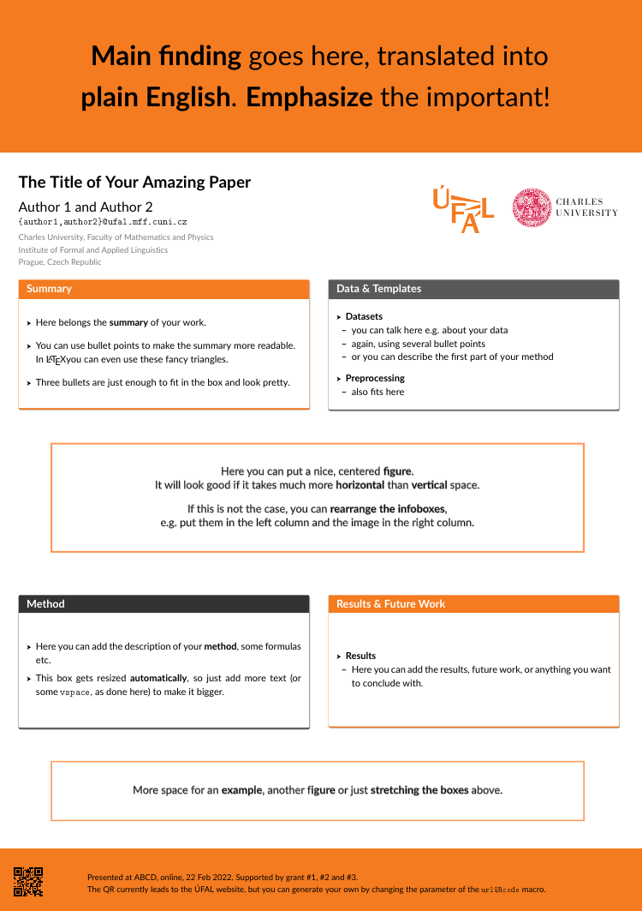

# UFAL Alternative Poster Template

A customized **poster template** to be used at the Institute of Formal and Applied Linguistics, Charles University. 


The repository contains **LaTeX and SVG** versions of template (the versions are not identical, but as similar as possible). The template is available only in the portrait mode.

The template based on the [modified Better Poster template](https://github.com/ufal/UFAL_poster), which is in turn based on the original [Mike Morrison](https://twitter.com/mikemorrison)'s  Better Poster.

### Preview



### Class Options

The `betterposter` class accepts three options which change the paper size:
 - `a0paper`, for A0, the default size.
 - `a1paper`, for A1.
 - `a2paper`, for A2.

These options behave like the usual LaTeX class options, for instance:
```
\documentclass[a0paper]{betterposter}
```
#### Other Class Options
The `betterposter` class extends the basic `article` class. Any options you give `betterposter`, other than the ones mentioned above, will be passed directly to `article`. For instance,
```
\documentclass[a0paper,fleqn]{betterposter}
```
will let `betterposter` deal with the `a0paper` option, but will pass `fleqn` directly to `article`.


## Acknowledgements

Mike Morrison - Author of **Better Poster** design

Rafael Bailo - design imported to latex

Tom Kocmi - modified for UFAL purposes, added vertical design